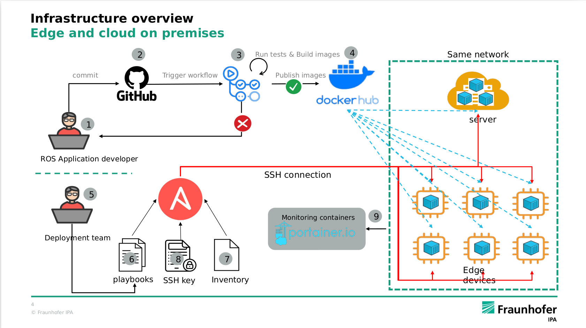

# Continuous Deployment pipeline for Better Factory

 An automated pipeline for rolling deployment for a network of 2D lidar system using Red Hat Ansible automation tool.  

> A rolling deployment is a deployment pattern where new software is delivered, usually to one or more deployment targets at a time, until all of the targets have the updated version of the software rolled out.

# Pipeline

# Contents

-   [Install](/docs/install.md)
-   [Getting started](/docs/gettingstarted.md)
-   [Usage](/docs/usage.md)
-   [Reference](/docs/reference.md)

